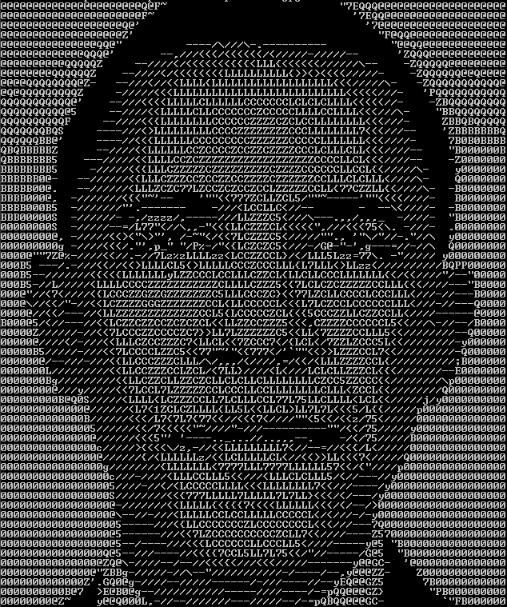
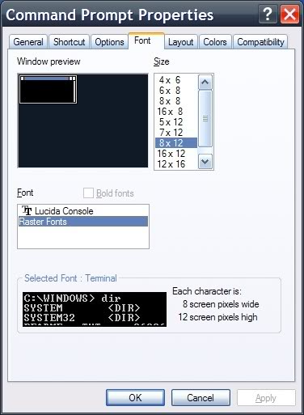

# Impress_your_crush_By_Cpp_ASCII_art 

Image to ASCII library



Converts an image to ASCII by mapping pixel brightness to characters that best resemble the local shape.

## For best results, use RASTER FONT 8x12



```
Steps:
    1. Open PowerShell as administrator
    2. Run your program there (not in Windows Terminal).
    3. Right‑click the title bar of that PowerShell window.
    4. Choose Properties (or Defaults if you want it to persist for all future windows).
    5. Go to the Font tab.
    6. In the Font list, select: Raster Fonts
    7. Below that, select the size that shows as 8x12.
    8. Click OK.
    9. Resize the window horizontally so no lines wrap (wider is better).
    10. Re-run:
    .\Debug\amg.exe -w 220 "https://i.pinimg.com/736x/45/ba/bc/45babc999f84f62f329c50ff8fef55eb.jpg" > output\6.Raster_Fonts.txt
```

## Features

- Converts images to ASCII art.
- Supports different levels of detail and character sets.
- Multi-threaded processing for faster conversion.

## Setup (Visual Studio)

Follow these steps to build and run the project in Visual Studio on Windows:

1. Update Visual Studio to the latest version available to ensure required components are present.
2. In Visual Studio, choose File > Open > Project/Solution and open `httptest.sln` from the repository folder.
3. If Visual Studio prompts to install required components or workloads, follow the prompts to install them — Microsoft Visual Studio will suggest the necessary files.
4. Open `main.cpp` in the solution explorer/editor.
5. Set the example image URL in `main.cpp`. For example:

```cpp
// main.cpp (example)
std::string setting_url = "https://i.pinimg.com/736x/45/ba/bc/45babc999f84f62f329c50ff8fef55eb.jpg";
```

The example above uses a publicly available image URL. Replace it with any publicly accessible image you have the right to use.

6. Build and run the executable without debugging using Ctrl+F5.

Notes:

- Ensure your machine has internet access when using an online image URL.
- Respect copyright and usage rights for images you process.
- If you prefer to use a local image file, modify the code accordingly to read from a local path instead of a URL.

## Try it

- Open `httptest.sln` in Visual Studio (Project/Solution)
- Edit `main.cpp` to point to your image URL
- Press Ctrl+F5 to build and run

# Other Settings

These are the configurable settings in `main.cpp` (defaults shown):

- `setting_url` (string): URL of the image to be converted.
  - Default in code: `"https://i.pinimg.com/736x/45/ba/bc/45babc999f84f62f329c50ff8fef55eb.jpg"`
- `setting_gamma` (bool): Enable gamma correction for better contrast in darker regions. Default: `true`.
- `setting_filter` (bool): Enable pixel averaging/filtering for smoother sampling. Default: `true`.
- `setting_multi` (bool): Enable multi-region shape matching (uses a 3x3 grid per character). Default: `true`.
- `setting_influence` (bool): Use influence-based scoring weights for regions. Default: `true`.
- `setting_simple` (bool): Use a simple character set. Default: `false`.
- `setting_random` (bool): Use a full character set with random selection among closest matches. Default: `false`.
- `setting_width` (int): Width of the output ASCII art in characters. Default: `79`.

You can change these defaults in code or override them via command-line options.

## Command-line options

The program accepts options followed by an image URL. Options are case-insensitive.

- `-g` Disable gamma correction (turns `setting_gamma` off)
  - Example:
    ```powershell
    .\Debug\amg.exe -g "https://i.pinimg.com/736x/45/ba/bc/45babc999f84f62f329c50ff8fef55eb.jpg" > output\flag_g_disable_gamma.txt
    ```
- `-f` Disable pixel filtering (turns `setting_filter` off)
  - Example:
    ```powershell
    .\Debug\amg.exe -f "https://i.pinimg.com/736x/45/ba/bc/45babc999f84f62f329c50ff8fef55eb.jpg" > output\flag_f_disable_filter.txt
    ```
- `-m` Disable multi-region matching (turns `setting_multi` off)
  - Example:
    ```powershell
    .\Debug\amg.exe -m "https://i.pinimg.com/736x/45/ba/bc/45babc999f84f62f329c50ff8fef55eb.jpg" > output\flag_m_no_multi.txt
    ```
- `-i` Disable influence-based scoring (turns `setting_influence` off)
  - Example:
    ```powershell
    .\Debug\amg.exe -i "https://i.pinimg.com/736x/45/ba/bc/45babc999f84f62f329c50ff8fef55eb.jpg" > output\flag_i_no_influence.txt
    ```
- `-s` Use a simple character set (turns `setting_simple` on)
  - Example:
    ```powershell
    .\Debug\amg.exe -s "https://i.pinimg.com/736x/45/ba/bc/45babc999f84f62f329c50ff8fef55eb.jpg" > output\flag_s_simple.txt
    ```
- `-r` Use a full character set with randomness (turns `setting_random` on)
  - Example:
    ```powershell
    .\Debug\amg.exe -r "https://i.pinimg.com/736x/45/ba/bc/45babc999f84f62f329c50ff8fef55eb.jpg" > output\flag_r_random.txt
    ```
- `-w [width]` Set the output width, e.g., `-w 120`
  - Example:
    ```powershell
    .\Debug\amg.exe -w 120 "https://i.pinimg.com/736x/45/ba/bc/45babc999f84f62f329c50ff8fef55eb.jpg" > output\flag_w_width120.txt
    ```

Notes:

- The first non-flag argument is treated as the image URL.
- `-w` must be followed by a number (space separated).
- If both `-s` and `-r` are passed, simple mode (`-s`) takes precedence in practice.

## Combined best 3 Examples (PowerShell on Windows)

From the project directory (where the built executable resides in `Debug`):

1. High-detail (default behavior) with a wider width (120 columns):
   ```powershell
   .\Debug\amg.exe -w 120 "https://i.pinimg.com/736x/45/ba/bc/45babc999f84f62f329c50ff8fef55eb.jpg" > output\combo1_high_detail_width120.txt
   ```
2. Fast & clean (simple charset, no gamma, medium width 100):
   ```powershell
   .\Debug\amg.exe -s -g -w 100 "https://i.pinimg.com/736x/45/ba/bc/45babc999f84f62f329c50ff8fef55eb.jpg" > output\combo2_simple_fast.txt
   ```
3. Artistic random full set (random + no influence + width 100):
   ```powershell
   .\Debug\amg.exe -r -i -w 100 "https://i.pinimg.com/736x/45/ba/bc/45babc999f84f62f329c50ff8fef55eb.jpg" > output\combo3_random_artistic.txt
   ```

- see the ASCII in terminal WITHOUT saving to a file:

```powershell
.\Debug\amg.exe -w 120 "https://i.pinimg.com/736x/45/ba/bc/45babc999f84f62f329c50ff8fef55eb.jpg"
```

## Raster Font Tip

Tip: For best visual results in the terminal, set the console font to "Raster Fonts" 8x12.

## License

See the `LICENSE` file in this repository.
